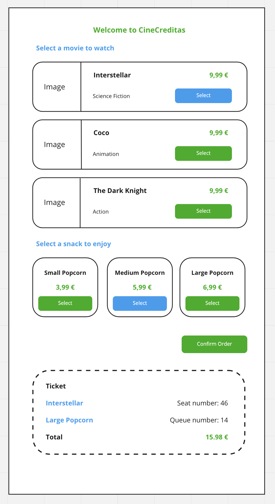
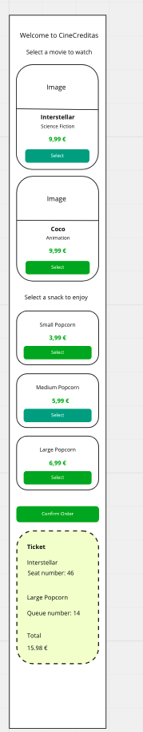

# Frontend Challenge - Creditas

This is a challenge designed to measure the candidate's expertise.
We would like to clarify that we don't expect everyone to be able to finish the whole challenge, since it has been designed to cover several degrees of expertise, from junior to senior.
Nevertheless, we expect anyone interested in becoming a tripulante in Creditas to give it a try.

In this challenge,cd we focus both on code design and design patterns in JavaScript. The goal is to assess your experience in writing **code that is easy to maintain, loosely coupled and highly cohesive**.

At Creditas we always work giving constructive feedback, therefore we will always dedicate the outmost attention to every solution submitted, contacting you back with the positive aspects of your submission and what could be improved. Just for that it is worth trying! :)

## The challenge

Cine Creditas it is getting bigger and bigger and needs to create a **sistema de reservas automatizado**

In order to make a booking, users must select a **film** and a **complement** ( food, drink, etc ...).

It is **important** to remark that our business model requires the user to select both elements ( a film and a complement )

Once the user has selected both items, a ticket will be displayed describing user's choice.

Your mission will be to build a web application where the user can see both a list of films and a list of complements and display the corresponding ticket.

Lastly, due to the traffic we are generating, we are averaging over 10 seconds to generate the ticket.

Here is where we need you !! .. can you help us to reduce this **tiempo de respuesta?**

## Resources

### Endpoints

- get /api/films

  response

  ```javascript
  films: [
    {
      id: "id",
      img: "url/img1",
      title: "title1",
      genre: "genre1",
      price: "price1",
    },
  ];
  ```

- get /api/snacks

  response:

  ```javascript
  snacks: [
    {
      description: "description1",
      price: "price1",
    },
  ];
  ```

- post /api/films/confirm

  request:

  ```javascript
  {
    id: "1";
  }
  ```

  response:

  ```javascript
  {
    seatNumer: "1";
  }
  ```

- post /api/snacks/confirm

  request:

  ```javascript
  {
    id: "1";
  }
  ```

  response:

  ```javascript
  {
    orderNum: "1";
  }
  ```

- post /api/ticket

  request

  ```javascript
  {
    seatNumber: "1",
    orderNum: "1"
  }
  ```

  response

  ```javascript
  {
    ticket;
  }
  ```

### Layout

The template requires some css rules in order to be displayed as proposed in the screenshots provided. Feel free to use any property you feel like to achieve so.

#### Desktop version



#### Mobile version



## Development

### Prerequisites

You will need to install on your machine:

- [NodeJs](https://nodejs.org/en/) in order to run the application.
- [Git](https://git-scm.com/book/en/v2/Getting-Started-Installing-Git) in order to clone the repository containing this challenge and submit the pull request with your solution.

### Configuration to run the environment

By executing the following lines of code in your terminal you will be able to:

- Clone the repository containing this challenge.
- Install the necessary dependencies to run the application.
- Run the application.

```shell
git clone https://github.com/Creditas/frontend-challenge-vlc.git
cd frontend/
npm install
npm start
```

If everything is correct, you should be able to access the following URL: [http://localhost:4000/](http://localhost:4000/).

### Dependencies

This project uses some libraries to assist us with tests and running the application. Those are:

- [Webpack](https://webpack.js.org/)
- [Babel](https://babeljs.io/)
- [Jest](https://jestjs.io/)
- [Eslint)[https://eslint.org/]

## Tests

To run the tests you must execute the following command:

```shell
npm test
```

## Must have

- README file containing instructions for the project setup along with the chosen stack

## Extra points

- Extra explanation in your README file such as architectural overview, testing strategy, things to improve (next steps) etc

## Stack

- You are free to choose the stack and language that you feel comfortable with!

## Evaluation

Some other things that matter to us:

- Your ability to write testable code
- Code organization and convention
- Code reusability

## Delivering the challenge

- Please fork our repository to your GitHub account.
- Once you are happy with your solution, upload it and grant access to **@Creditas/valencia-frontend**.
- We will download your code, thoroughly go through it and come back with feedback within a few days.
- In the meantime, please give us your sincere (no sugar coating!) [opinion](https://docs.google.com/forms/d/e/1FAIpQLSdwjudz38JMtMYf3rFBrMHX3XMy2J5oBLPnjBGD1QKvOM2SGg/viewform) on the challenge.
  We would like you to send it **even if you didn't finish the challenge**. Here at Creditas, constructive feedbacks are part of our culture.

Thanks for your time and interest in joining us!!
