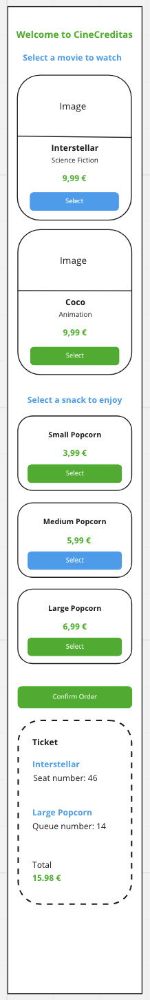

# Frontend Challenge

This is a challenge designed to measure the candidate's expertise.

In this challenge, we focus both on code design and design patterns in JavaScript.

In order to align expectations, we consider that you should spend **not more than 6 hours** to finish the challenge.

At Creditas, we value giving (and receiving) constructive feedback, therefore we will always dedicate the outmost attention to every solution submitted, contacting you back with the positive aspects of your submission and what could be improved.

Just for that, it is worth trying! :). We also ask you to help us to improve our hiring process, at the end of this file you will find a form allowing you to share your impressions with us

## The challenge

Cine Creditas is getting bigger and bigger and needs to create a self-service booking system.

In order to make a booking, our clients must select a **film** and a **snack**.

It is **important** to remark that our business model requires the client to select both elements ( a film and a snack )

Once the client has selected both items, they must confirm their selection and as a result, a ticket will be displayed describing the client's choice.

Your mission will be to build a web application where the client can see both a list of films and a list of snacks, have the possibility to confirm their selection and display the corresponding generated ticket.

Right now due to the high amount of clients accessing our website, we are averaging over 10 seconds to generate the ticket.

As part of the challenge we need your help in order to reduce this delay as much as possible.

## Resources

### Endpoints

- GET https://frontend-challenge-vlc-api.public.dev.creditas.io/api/films

  response

  ```javascript
  {
    films: [
      {
        id: string,
        title: string,
        genre: string,
        price: number,
        imageUrl: string,
      },
    ];
  }
  ```

- GET https://frontend-challenge-vlc-api.public.dev.creditas.io/api/snacks

  response

  ```javascript
  {
    snacks: [
      {
        id: string,
        name: string,
        price: number,
      },
    ];
  }
  ```

- POST https://frontend-challenge-vlc-api.public.dev.creditas.io/api/films/confirm

  request

  ```javascript
  {
    id: string;
  }
  ```

  response

  ```javascript
  {
    seatNumber: number;
  }
  ```

- POST https://frontend-challenge-vlc-api.public.dev.creditas.io/api/snacks/confirm

  request

  ```javascript
  {
    id: string;
  }
  ```

  response

  ```javascript
  {
    queueNumber: number;
  }
  ```

### Layout

The template requires some css rules in order to be displayed as proposed in the screenshots provided. Feel free to use any property you feel like to achieve so.

#### Styleguide


#### Desktop version


#### Mobile version



## Your solution

### Must have

- README file containing instructions for the project setup along with the chosen stack

### Extra points

- Extra explanation in your README file such as architectural overview, testing strategy, things to improve (next steps) etc

### Stack

- You are free to choose the stack and language that you feel comfortable with!

## Evaluation

Some other things that matter to us:

- Your ability to write testable code
- Code organization and convention
- Code reusability

## Delivering the challenge

- Once you are happy with your solution, please upload it to a **private** github repository and grant access to **@Creditas/valencia-frontend**.

- In the meantime, please give us your sincere (no sugar coating!) [opinion](https://docs.google.com/forms/d/e/1FAIpQLSdwjudz38JMtMYf3rFBrMHX3XMy2J5oBLPnjBGD1QKvOM2SGg/viewform) on the challenge. We would like you to receive it **even if you didn't finish the challenge**. Here at Creditas, constructive feedbacks are part of our culture.

Thanks for your time and interest in joining us!!
